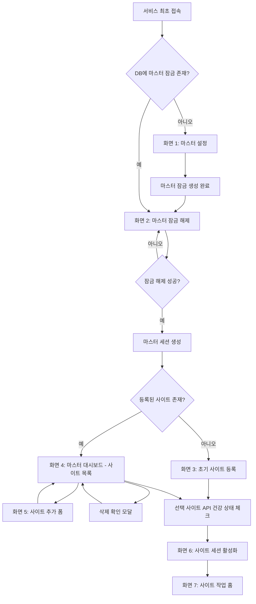

# 멀티사이트 첫 화면 초안

> 상태: Draft v0.4 / 2026-03-10 SSOT 보정
> 목적: 멀티사이트 기능의 첫 진입 화면, 상태별 전환 기준, 마스터 진입 흐름을 고정한다.

## 1. 문제 정의

현재 멀티사이트는 기능 단위는 들어가 있지만, 아래 기준이 약하다.

- 앱 시작 직후 어디로 보내야 하는가
- 사이트가 0개 / 1개 / 여러 개인 경우 첫 화면이 어떻게 달라져야 하는가
- 로그인 세션이 없을 때 첫 작업이 무엇이어야 하는가
- 사이트 전환과 실제 관리 작업 진입의 우선순위가 무엇인가

이 문서는 "예쁜 랜딩"이 아니라 "관리 작업으로 빠르게 들어가는 첫 화면"을 기준으로 한다.
첫 화면은 단일 컬럼 기준으로 짧은 앱 소개 히어로와 보안 저장소 안내 카드만 두며, 상단 툴바·부가 카드·장황한 설명은 배치하지 않는다.

## 1.1 현재 반영 상태

- 이미 존재하는 하위 사이트 화면
  - `/sites/onboarding`
  - `/sites/dashboard`
  - `/sites/:siteId/activate`
  - `/sites/:siteId/login`
  - `/sites/:siteId/overview`
- 이미 존재하는 구조 변화
  - 상단 `작업 탭(고정 최상위 + 열린 사이트 + 더보기)` 구조 적용
  - 좌측은 현재 탭의 서브메뉴만 보여주도록 정리
- 현재 구현 완료 항목
  - 앱 시작은 `마스터 잠금 설정/해제` gate를 먼저 거친다.
  - bundled `app-config.json` / legacy `apiBaseUrl`은 첫 사이트 입력에 관여하지 않는다. 자동 주입도, 추천 URL 노출도 하지 않는다.
  - `마스터 계정/ID` 대신 `로컬 마스터 잠금`으로 용어와 흐름을 정리했다.
  - 15분 idle auto-lock과 수동 `앱 잠금` 경로가 동작한다.
  - 선택형 Google OTP(TOTP) 2차 인증과 unlock rate limit/temporary lockout이 동작한다.
  - `/app/security`에서 `tauri-plugin-biometry v0.2.6` 기반 빠른 잠금 해제(Touch ID / Windows Hello) 등록/폐기가 동작한다.
  - 상단 `보안 설정` 메뉴에서 마스터 비밀번호 변경, OTP 활성화/해제, 자동 잠금 시간을 관리할 수 있다.
  - `/sites/dashboard`에서 `휴대용 암호화 백업(.g5bak)` export/import를 지원하고, 기존 `.db` SQLCipher 스냅샷 import는 레거시 호환 경로로만 유지한다.
  - `백업 export/import`, `전체 사이트 삭제`, `마스터 비밀번호 변경`, `자동 잠금 시간 변경`, `OTP 비활성화`는 현재 마스터 비밀번호 재인증을 요구하고, OTP가 활성화된 경우 현재 OTP 코드도 함께 확인한다.
- 현재 남은 항목
  - SSH/SFTP, 코드 편집, 헬스 대시보드 같은 P1 이후 범위는 아직 미구현이다.
- 이제 고정하는 기준
  - 앱 시작은 항상 `로컬 마스터 잠금 설정/해제`부터 시작한다.
  - 첫 사이트는 사용자가 직접 입력한다.
  - `마스터 계정`이 아니라 `로컬 마스터 잠금(비밀번호 + 빠른 잠금 해제)`을 사용한다.
  - 로컬 마스터 비밀번호는 앱 전용이며 로컬 SQLite의 verifier로만 저장한다.
  - 사이트 관리자 비밀번호 검증은 계속 PHP API의 G5 레거시 호환 계층이 담당한다.

## 2. 형님 제안 플로우 반영 결론

형님이 주신 흐름은 제품 UX 관점에서는 맞다.

특히 아래는 채택하는 것이 맞다.

1. 앱 시작 후 바로 관리자 메뉴가 아니라 `마스터 진입 -> 사이트 선택/등록 -> 사이트 작업` 순서로 간다.
2. 사이트가 없으면 첫 사이트 등록으로 보낸다.
3. 사이트가 여러 개면 사이트 목록이 첫 작업면이 된다.
4. 최종 작업 홈은 과한 랜딩이 아니라 `현재 사이트 상태 + 빠른 작업` 중심으로 구성한다.
5. 사이트 전환 UI는 `고정 최상위 탭 + 열린 사이트 탭 + 더보기 + 좌측 서브메뉴` 조합으로 유지한다.

이제 더 이상 아래 식의 단계 분리를 허용하지 않는다.

- 사이트 플로우만 먼저 열고 마스터 잠금을 나중에 붙이는 우회 구현
- bundled 설정을 기본 사이트로 밀어 넣고 나중에 수동 입력을 붙이는 우회 구현
- 로컬 앱 진입 인증을 PHP 관리자 계정과 같은 층위로 취급하는 설계

이 문서의 canonical 기준은 아래다.

- 앱 시작은 항상 `마스터 잠금 설정 -> 마스터 잠금 해제 -> 사이트 선택/등록 -> 사이트 작업` 순서로 간다.
- 마스터 잠금용 비밀번호는 로컬 앱 잠금 전용이고, PHP 사이트 관리자 비밀번호와 섞지 않는다.
- 빠른 잠금 해제(Touch ID / Windows Hello)는 마스터 잠금 계층의 일부다.
- 사이트 등록/선택/로그인/작업 홈은 모두 마스터 잠금 해제 뒤에만 노출한다.

## 3. 핵심 원칙

1. 첫 화면은 소개 페이지가 아니라 현재 상태를 해결하는 작업면이어야 한다.
2. 사이트 선택 전에는 좌측 관리자 메뉴를 강하게 노출하지 않는다.
3. 사이트가 정해지면 그 다음은 바로 로그인 또는 작업 진입이다.
4. 요약은 최소만 두고, 이미 메뉴/폼에서 다시 보는 정보는 중복하지 않는다.
5. 감사 상태, 구현 상태, 내부 기술 설명은 첫 화면에 두지 않는다.
6. 사이트 선택 UI와 사이트별 관리자 메뉴 UI는 분리한다.
7. 멀티사이트 수가 늘어도 버틸 수 있게 등록 사이트 전체를 탭에 모두 노출하지 않고, 열린 사이트만 상단 탭에 올리며 나머지는 `더보기`로 처리한다.

## 4. 목표 플로우



## 5. 상태별 첫 화면

| 상태 | 첫 화면 | 목적 |
|---|---|---|
| 최초 실행 + 마스터 잠금 없음 | 마스터 설정 | 로컬 앱 잠금 bootstrap |
| 마스터 잠금 있음 + 잠금 상태 | 마스터 잠금 해제 | 로컬 진입 인증 |
| 사이트 0개 | 초기 사이트 등록 | 첫 사이트를 만들게 한다 |
| 사이트 1개 + 사이트 세션 없음 | 해당 사이트 로그인 화면 | 바로 로그인시키고 관리 작업으로 넣는다 |
| 사이트 1개 + 사이트 세션 있음 | 해당 사이트 작업 홈 | 바로 작업을 시작하게 한다 |
| 사이트 여러 개 + 사이트 미선택 | 마스터 대시보드 - 사이트 목록 | 어느 사이트에 들어갈지 먼저 결정하게 한다 |
| 사이트 여러 개 + 활성 사이트 세션 있음 | 활성 사이트 작업 홈 | 현재 사이트 작업 지속 + 빠른 전환 |
| 사이트 여러 개 + 활성 사이트 세션 만료 | 활성 사이트 로그인 화면 | 사이트는 유지하고 인증만 다시 받게 한다 |

## 6. 앱 시작 플로우

### 6.1 최종 목표 플로우

```text
앱 시작
  -> 단일 히어로 + 보안 저장소 안내 화면
    -> 사용자가 계속 클릭
  -> 로컬 마스터 잠금 확인
    -> 마스터 잠금 없음
      -> /master/setup
    -> 마스터 잠금 있음 + 잠금 상태
      -> /master/unlock
    -> 마스터 잠금 해제 완료
      -> SiteCatalog 조회
        -> 사이트 0개
          -> /sites/onboarding
        -> 사이트 1개 이상
          -> 마지막 활성 사이트 또는 default 사이트 결정
            -> 활성 사이트 세션 유효
              -> /sites/:siteId/overview
            -> 활성 사이트 세션 없음
              -> 사이트가 1개면 /sites/:siteId/login
              -> 사이트가 여러 개면 /sites/dashboard
```

### 6.2 폐기된 우회 플로우

아래 흐름은 더 이상 SSOT가 아니다.

- 앱 시작 직후 `SiteCatalog`를 먼저 조회하는 흐름
- 마스터 잠금 없이 사이트 온보딩/대시보드/로그인으로 바로 들어가는 흐름
- legacy `app-config.json`을 `기본 사이트`로 자동 승격하는 흐름

구현 기준으로 사용 금지.

## 7. 화면별 구성

### 7.1 화면 1: 마스터 설정

상태:
필수 구현

목적:
앱 진입을 잠그는 로컬 마스터 잠금을 안전하게 생성

필수 요소:

- 비밀번호
- 비밀번호 확인
- 잠금 생성 버튼

주의:

- 이 계층은 현재 PHP 관리자 로그인과 별도다.
- 즉, "앱 진입 인증"이지 "사이트 관리자 인증"이 아니다.
- 비밀번호 평문은 저장하지 않고, 로컬 SQLite에는 salted verifier만 저장한다.

### 7.2 화면 2: 마스터 잠금 해제

상태:
필수 구현

필수 요소:

- 비밀번호
- 빠른 잠금 해제 버튼
- 일반 잠금 해제 버튼

보안 메모:

- 로컬 rate limit과 temporary lockout은 구현됐다.
- unlock BF 방어는 `5회 실패 -> 5분`, 이후 실패마다 `+5분`, 최대 `60분` cap 기준이다.
- 차단 중에는 비밀번호 입력과 진행 버튼을 모두 비활성화한다.
- 빠른 잠금 해제 secret은 OS biometry secure storage에만 저장하고, SQLite에는 verifier만 남긴다.
- 현재 데스크톱 빠른 잠금 해제는 `tauri-plugin-biometry v0.2.6`을 사용하고, 폴백은 계속 마스터 비밀번호다.

### 7.3 화면 3: 초기 사이트 등록

화면 이름:
`첫 사이트 등록`

필수 요소:

- 환영 메시지
- 사이트 이름
- API URL
- 연결 테스트 버튼
- 첫 번째 사이트 등록 버튼
- 실패 시 에러 메시지

보조 요소:

- `예: https://example.com/api/v1`
- 레거시 `app-config.json`의 URL은 첫 사이트 입력에 사용하지 않는다
- 연결 테스트 중에는 spinner와 `운영체제가 네트워크 접근이나 방화벽 허용을 묻는 경우 먼저 승인` 안내를 유지한다

금지 요소:

- 긴 히어로 문구
- 전체 관리자 메뉴 미리보기
- 감사/디버그 정보

### 7.4 화면 4: 마스터 대시보드 - 사이트 목록

화면 이름:
`사이트 목록`

필수 요소:

- 등록된 사이트 목록
- 각 사이트의 이름, URL, 최근 사용 시간, 건강 상태
- `접속` 버튼
- `삭제` 버튼
- `+ 사이트 추가 등록` 버튼
- 마스터 로그아웃 버튼

보조 요소:

- 검색
- 최근 사용 사이트 우선 정렬
- 삭제 확인 모달

금지 요소:

- 전체 서비스 소개
- 사이트별 과한 카드 설명

### 7.5 화면 5: 사이트 추가 폼

필수 요소:

- 사이트 이름
- API URL
- 연결 테스트 버튼
- 등록 버튼
- transport error가 나도 즉시 실패하지 않는 retry window

### 7.6 화면 6: 사이트 세션 활성화

목적:
선택한 사이트의 세션을 활성화하고 적절한 화면으로 넘긴다

필수 요소:

- 로딩 스피너
- `사이트 세션을 활성화 중입니다...` 문구

로직:

- 선택 사이트 health check
- active site 전환
- 세션 존재 시 overview
- 세션 없으면 login

### 7.7 화면 7: 사이트 로그인

화면 이름:
`사이트 로그인`

필수 요소:

- 현재 사이트 이름
- 현재 사이트 API URL
- 관리자 아이디
- 비밀번호
- 일반 로그인 버튼
- 다른 사이트로 바꾸기 버튼

보조 요소:

- 연결 상태 확인
- 최근 인증 실패 사유

금지 요소:

- 사이트 목록 전체 재노출
- 불필요한 운영 지표

### 7.8 화면 8: 사이트 작업 홈

화면 이름:
`사이트 작업 홈`

필수 요소:

- 현재 사이트 이름
- 현재 사이트 API URL
- 연결 상태
- 주요 메뉴 바로가기
  - 게시글 관리
  - 회원 관리
  - 쇼핑몰 관리
  - 시스템 설정
- 최근 작업
- 시스템 상태 요약

보조 요소:

- 최근 에러 1줄
- 마지막 동기화/호출 시간

금지 요소:

- 랜딩형 대형 히어로
- 구현률, 감사 상태, parity 수치
- 메뉴 설명 카드 과다 노출

## 8. 사이트 목록 배치 결론

결론:
좌측 사이드바 구조를 우선 채택한다.
상단 작업 탭은 canonical UX에 포함하되, 등록 사이트 전체가 아니라 `열린 사이트 + 더보기` 구조를 사용한다.

이유:

1. 탭 구조는 사이트 수가 늘면 바로 깨진다.
2. 현재 사이트 컨텍스트를 항상 눈에 띄게 유지하기 쉽다.
3. 사이트 전환과 사이트별 관리자 메뉴를 한 프레임 안에서 분리할 수 있다.

추천 구조:

```text
┌ 상단 글로벌 바 ─────────────────────────────────────────────┐
│ 그누5어드민 | 현재 사이트: 월척 커뮤니티 ▼ | 마스터님 ▼      │
├ 좌측 ─────────────────┬ 중앙 ───────────────────────────────┤
│ 사이트 목록           │ [ 사이트 작업 홈 ]                  │
│ 검색                  │ 환영 메시지                         │
│ > Wolchuk             │ 시스템 상태                         │
│ > Shop_v1             │ 빠른 링크                           │
│ > Blog_xyz            │ 최근 작업                           │
│ + 사이트 추가         │                                      │
│ --------------------  │                                      │
│ 사이트별 상세 메뉴    │                                      │
│ - 회원 관리           │                                      │
│ - 게시판 관리         │                                      │
│ - 설정                │                                      │
└──────────────────────┴──────────────────────────────────────┘
```

## 9. 작업 홈 레이아웃 초안

```text
┌ 상단 ───────────────────────────────────────────────┐
│ 브랜드 | 고정 최상위 탭 | 열린 사이트 탭 | 더보기 | 검색 | 사용자/표시 툴바 │
├ 좌측 ─────────────────┬ 중앙 ───────────────────────┤
│ 현재 탭 서브메뉴      │ [현재 사이트 상태]          │
│ --------------------  │ 이름 / URL / 연결상태       │
│ 주요 작업면 링크      │                              │
│                      │ [주요 메뉴 바로가기]         │
│                      │ 게시글 회원 쇼핑몰 설정      │
│                      │                              │
│                      │ [최근 작업]                  │
│                      │ 최근 이동/수정/실패 5건      │
└──────────────────────┴──────────────────────────────┘
```

## 10. 라우트 제안

- 마스터 설정: `/master/setup`
- 마스터 잠금 해제: `/master/unlock`
- 사이트 0개: `/sites/onboarding`
- 사이트 목록: `/sites/dashboard`
- 사이트 로그인: `/sites/:siteId/login`
- 사이트 작업 홈: `/sites/:siteId/overview`

추가 규칙:

- `/overview` 직접 진입 시 사이트 결정 전이면 `/sites/dashboard` 또는 `/sites/onboarding`으로 보낸다.
- 사이트 컨텍스트 없는 상태에서 관리자 하위 라우트 직접 진입은 허용하지 않는다.

## 11. 구현 우선순위

### P0 지금 바로 구현

2026-03-10 기준 구현 완료:

1. 마스터 설정 화면 (`/master/setup`)
2. 마스터 잠금 해제 화면 (`/master/unlock`)
3. 앱 시작 라우팅을 `/master/*` gate 기준으로 고정
4. 첫 사이트 수동 등록 강제
5. 사이트 목록 대시보드 고정
6. 사이트 로그인 화면 고정
7. 사이트 작업 홈의 카드 수 축소와 정보 우선순위 정리
8. 좌측 `사이트 목록 / 사이트별 메뉴` 2층 구조 고정
9. bundled/legacy `apiBaseUrl` 자동 기본 사이트 주입 제거
10. 선택형 Google OTP(TOTP) 2차 인증
11. unlock rate limit / temporary lockout
12. `/app/security` 보안 설정 화면

구현 메모:

- 로컬 마스터 비밀번호는 SQLite `app_lock`의 verifier로 저장된다.
- DB 암호화 키와 TOTP secret은 OS keyring에 저장된다.
- legacy `apiBaseUrl`은 첫 사이트로 자동 삽입되지 않으며, 온보딩 폼에서도 노출하지 않는다.
- 빠른 잠금 해제는 `tauri-plugin-biometry v0.2.6`을 통해 실제로 동작하며, OS biometry secure storage의 랜덤 secret과 SQLite verifier를 함께 사용한다.

### P1 추가 설계 후 구현

1. SSH / SFTP 세부 구현
2. 마스터 세션
3. 헬스 대시보드 / Quick Actions

## 12. 충돌/결정 필요 포인트

1. 로컬 진입 인증은 PHP 관리자와 분리된 `마스터 잠금`으로 고정한다.
2. 빠른 잠금 해제는 `tauri-plugin-biometry v0.2.6` 기준으로 고정했고, 공식 `tauri-plugin-biometric` Rust crate `2.3.2`는 여전히 현재 구현에 사용하지 않는다.
3. 사이트 선택 후 즉시 overview로 갈지, 항상 건강 상태 체크 중간 화면을 둘지
4. 사이트가 여러 개여도 마지막 활성 사이트로 바로 들어갈지, 매번 사이트 목록을 먼저 보여줄지

## 13. 형님이 체크해주실 포인트

아래만 맞다/아니다로 정하면 다음 구현이 빨라진다.

1. 사이트 여러 개일 때 첫 화면을 `사이트 목록 대시보드`로 고정할지, 마지막 활성 사이트로 바로 보낼지
2. 사이트 작업 홈 카드가 `현재 사이트 상태 / 빠른 링크 / 최근 작업` 3개면 충분한지
3. 빠른 잠금 해제 등록 UX를 첫 설정 직후에도 붙일지, 계속 `/app/security`에서만 관리할지
4. 사이트 등록을 `연결 테스트 -> 등록` 2단계로 갈지, 한 번에 등록할지

## 14. 형님이 그려주시면 좋은 프로세스 형식

형님이 다음처럼만 적어주시면 바로 화면 구현 기준으로 옮길 수 있다.

```text
[상태]
사이트 여러 개 + 미로그인

[첫 화면]
사이트 선택

[목적]
어느 사이트에 로그인할지 먼저 정한다

[필수 요소]
사이트 목록
최근 사용
로그인 버튼
새 사이트 추가

[금지]
긴 소개문
과한 카드형 요약
감사/디버그 문구
```
